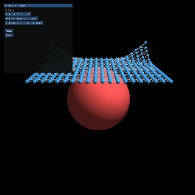
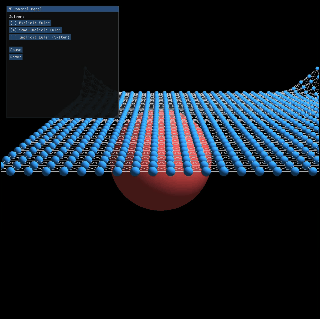

# 计算机图形学实验7 - 基于质点-弹簧模型的布料物理仿真与数值积分器

202411081009 吴仲霞 计算机科学与技术
---

本仓库包含一个基于 **Taichi 框架** 开发的高性能 3D 布料物理仿真系统。系统完整实现了结构弹簧、剪切弹簧及弯曲弹簧，支持球体碰撞检测，并集成了三种经典的数值积分求解器（显式欧拉、半隐式欧拉、隐式欧拉定点迭代），用于对比和研究物理模拟中的数值稳定性与数值阻尼问题。

## 一、 实验环境与配置规范

为保证物理仿真系统的实时编译（AOT/JIT）与 GPU 并行加速正常运行，严格按照以下规程配置环境。

### 1. 软件环境依赖

* **操作系统**: Windows 10/11, Ubuntu 20.04+, 或 macOS (M1/M2/M3)
* **Python 版本**: `Python 3.12.x` (推荐)
* **核心框架**: `Taichi == 1.7.4` (基于其内置的 GGUI 模块进行 3D 渲染)
* **后端驱动**: Vulkan / CUDA (Taichi 将根据硬件自动选择最高效的 GPU 后端)

### 2. 环境激活与安装规程

打开终端或 Anaconda Prompt，执行以下命令：

```bash
# 1. 创建独立的 Conda 虚拟环境
conda create -n cloth_sim_env python=3.12 -y

# 2. 激活虚拟环境
conda activate cloth_sim_env

# 3. 安装 Taichi 核心计算与渲染框架
pip install taichi==1.7.4

# 4. 验证安装是否成功（应能看到 Taichi 打印的硬件初始化信息）
ti changelog

```

## 二、 实验原理与架构设计

### 1. 多级弹簧拓扑模型

为了摆脱基础布料模拟的“僵硬感”，本实验构建了完整的布料力学拓扑网络：

* **结构弹簧 (Structural)**: 连接 $(i, j)$ 与相邻的 $(i+1, j)$、$(i, j+1)$，抵御拉伸形变。
* **剪切弹簧 (Shear)**: 连接对角线质点 $(i, j)$ 与 $(i+1, j+1)$，防止布料发生平行四边形剪切错位。
* **弯曲弹簧 (Bending)**: 跨越一个质点连接 $(i, j)$ 与 $(i+2, j)$，提供抗弯曲刚度，其劲度系数的大小直接决定了布料的柔软度。

### 2. 数值积分器数学表述

根据牛顿第二定律 $a = F/m$，我们在离散时间步长 $\Delta t$ 内更新质点状态：

* **显式欧拉**: $x_{t+1} = x_t + v_t \Delta t$, $v_{t+1} = v_t + a_t \Delta t$（完全基于当前受力预测，极易爆炸）。
* **半隐式欧拉**: $v_{t+1} = v_t + a_t \Delta t$, $x_{t+1} = x_t + v_{t+1} \Delta t$（使用新速度更新位置，具备辛几何守恒特性）。
* **隐式欧拉 (定点迭代)**: $v_{t+1} = v_t + a(x_{t+1}, v_{t+1}) \Delta t$，通过多轮迭代逼近未来时刻的力平衡，稳定性极高。

### 3. GPU 并行同步与开销优化

* **多 Kernel 拆分**: 初始化阶段（位置、拓扑、索引）由于存在先后依赖，拆分为多个 `@ti.kernel` 在 Python 侧顺序启动，利用主线程隐式同步，确保 GPU 数据无脏读。
* **强制内联 (`@ti.func`)**: 受力计算与速度钳制声明为 `ti.func`，在编译期直接展开至积分 Kernel 内部，**实现单步更新仅启动一次 Kernel**，消除了高频循环下的 GPU 启动开销。
* **原子操作 (`ti.atomic_add`)**: 由于多条弹簧共享同一质点，在计算弹簧力时使用原子加锁，杜绝多线程写入冲突。


## 三、 实验操作规程

### 1. 启动仿真

在激活的环境下，导航至代码目录并运行主程序：

```bash
python main.py

```

### 2. GGUI 面板交互指南

系统右侧/左侧会呼出控制面板：

* **Solver 切换按钮**: 实时在 `Explicit Euler`、`Semi-Implicit Euler` 和 `Implicit Euler` 之间切换。*注意：切换时系统会自动重置布料，防止前一个算法的爆炸状态污染新算法。*
* **Pause / Resume**: 随时暂停物理时钟，便于观察特定帧下的布料褶皱或穿模状态。
* **Reset**: 一键将布料复位到初始水平悬空状态。
* **视角控制**: 在渲染视窗内**按住鼠标右键 (RMB) 并移动鼠标**可旋转相机，配合 **W/A/S/D/Q/E** 键可在 3D 空间中自由漫游。

## 四、 优化前后的对比分析（实验核心核心结论）

### 1. 求解器稳定性与参数表现对比

| 积分器类型 | 初始未优化表现 ($k_{bend}=4000$) | 参数调优后表现 ($k_{bend}=150$, $N=30$) | 数值稳定性 | 特点与现象分析 |
| --- | --- | --- | --- | --- |
| **显式欧拉**<br>

<br>*(Explicit)* | **瞬间数值爆炸**，质点飞出屏幕，即便有速度钳制也会高频剧烈抖动。 | 依然极不稳定，布料呈现严重的锯齿状撕裂。 | 极差 | 对时间步长 $\Delta t$ 要求严苛。由于刚度较高，系统能量在迭代中迅速放大。 |
| **半隐式欧拉**<br>

<br>*(Semi-Implicit)* | 布料整体下落正常，但**异常僵硬**。落在球体上时像一块硬塑料板，缺乏褶皱。 | **极其丝滑柔软**。下落后顺着球体自然滑落，并产生细密、逼真的丝绸质感褶皱。 | 良好 | 能量守恒度高，没有人工阻尼。最适合表现轻盈、柔软、高频摆动的动态布料。 |
| **隐式欧拉**<br>

<br>*(Implicit)* | 稳定下落，但动作缓慢、沉重，包裹球体时几乎没有形变。 | 表现稳定，褶皱较圆润，但下落动画显得**有些粘稠**。 | 极高 | 具备强力的**数值阻尼（Numerical Damping）**。虽然绝对不会爆炸，但由于低阶定点迭代的近似性，它会错误地消耗动能。 |

### 2. 核心参数调优逻辑

* **僵硬到柔软的蜕变**: 初始代码中弯曲弹簧系数 $k_{bend}$ 给到了 $4000.0$，这导致布料抗弯能力过强。将其调低至 $150.0$ 后，释放了布料的折叠自由度。
* **网格密度的视觉提升**: 将分辨率从 $20\times20$ 提升至 $30\times30$。虽然计算量增加，但由于配合了内联优化，实时帧率依然保持在 60FPS 以上，且更密的网格允许产生更细腻的局部褶皱。

## 五、 实验效果演示视频

为直观展示不同积分求解器以及刚度优化前后的物理表现差异，请参考以下演示视频序列。

### 视频 1：优化前（高刚度僵硬状态）与显式欧拉发散演示


* **文字说明**: 该视频展示了在初始高刚度参数下，显式欧拉积分器由于无法承受高频弹力而瞬间发生数值爆炸、质点飞散的现象；同时展示了隐式欧拉在刚度过高时，布料表现得像硬纸板一样僵硬且缺乏褶皱的垂坠状态。
* 参数为
```
N = 20             # 布料网格分辨率 N x N
mass = 1.0         # 质点质量
dt = 5e-4          # 时间步长
k_s = 10000.0      # 结构弹簧劲度系数
k_shear = 6000.0   # 剪切弹簧劲度系数 (选做)
k_bend = 4000.0    # 弯曲弹簧劲度系数 (选做)
k_d = 1.0          # 阻尼系数
gravity = ti.Vector([0.0, -9.8, 0.0])
max_velocity = 50.0  # 速度上限，防止数值爆炸
```

### 视频 2：优化后（半隐式欧拉 + 软化参数 + 球体碰撞）


* **文字说明**: 该视频展示了参数优化后的终极效果。使用半隐式欧拉求解器，弯曲刚度降至 $150.0$，网格提升至 $30\times30$。可以清晰地观察到，布料以极其柔软、丝滑的动态下落，在接触到红色球体表面时，碰撞处理器成功将其投影至表面并产生完美的滑动摩擦，布料顺着球体表面滑落，形成了高度逼真的多级丝绸褶皱。
* 参数为
```
N = 30             # 布料网格分辨率 N x N
mass = 1.0         # 质点质量
dt = 3e-4          # 时间步长
k_s = 12000.0      # 结构弹簧劲度系数
k_shear = 3000.0   # 剪切弹簧劲度系数 (选做)
k_bend = 150.0    # 弯曲弹簧劲度系数 (选做)
k_d = 0.1          # 阻尼系数
gravity = ti.Vector([0.0, -9.8, 0.0])
max_velocity = 50.0  # 速度上限，防止数值爆炸
```

## 六、 实验总结

通过本次实验，成功在 **Taichi** 框架下实现了高性能的物理仿真。实验结果确凿地证明了：在基于物理的动画中，**数值稳定性、拓扑结构（弹簧类型）与物理参数**三者必须紧密配合。半隐式欧拉在保持系统能量和展现多褶皱细节方面取得了最佳的平衡，而通过将力学计算内联至单一 Kernel 的架构设计，确保了在网格密度提升 2.25 倍后依然能够进行流畅的实时交互渲染。
